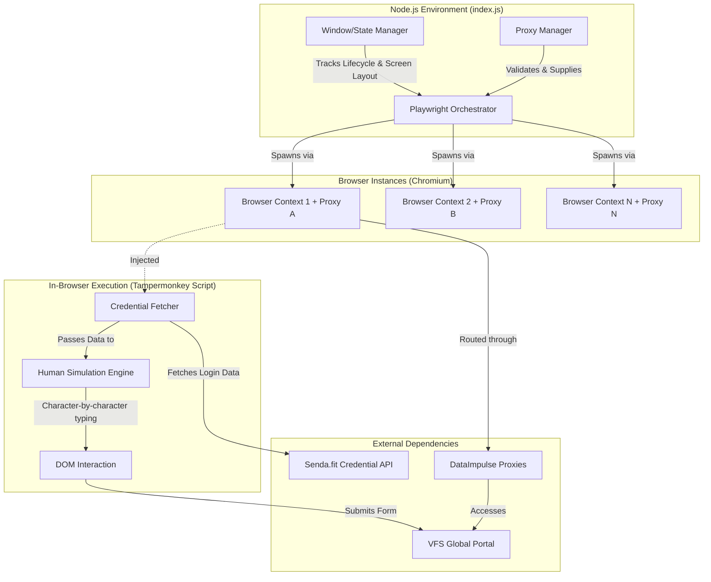

# VFS Global Auto-Login & Proxy Manager Architecture

## 1. System Overview

This project is a multi-layered automation system designed to concurrently access and log into the VFS Global portal (specifically for Nepal to Japan visa processing). It combines a Node.js-based infrastructure manager for handling rotated proxies and concurrent browser contexts with an in-browser userscript that simulates human interaction to bypass Angular-based bot detection mechanisms.

## 2. High-Level Architecture Diagram

## 3. Core Components

### 3.1. Proxy & Browser Manager (`index.js`)
A Node.js process acting as the master controller.
*   **Technology Stack**: Node.js, Playwright (`chromium`), `child_process`.
*   **Key Responsibilities**:
    *   **Screen Size Detection**: Dynamically detects the host OS (Windows, macOS, Linux) screen dimensions using system-level commands (e.g., PowerShell, `osascript`, `xdpyinfo`) to properly tile and size spawned browser windows (defaulting to 33% of screen size).
    *   **Proxy Rotation & Validation**: Cycles through a hardcoded list of DataImpulse proxies. It tests the proxy connection directly against the target URL before attempting to launch a full persistent window.
    *   **Concurrency Management**: Maintains a customizable maximum number of open windows (`maxOpenWindows: 2`). Tracks successful opens, failures, and skipped proxies. Automatically opens a new window when an existing one is closed or fails.
    *   **Evasion**: Launches non-headless Chromium with specific flags (`--disable-blink-features=AutomationControlled`) to mask automated control.

### 3.2. In-Browser Automation (`VFS Global Auto Login (Nepal → Japan)-4.0.user.js`)
A Tampermonkey userscript executing in the context of the target web page.
*   **Technology Stack**: Vanilla JavaScript (ES6+), Tampermonkey APIs (`GM_xmlhttpRequest`, `GM_setValue`, `GM_getValue`).
*   **Key Responsibilities**:
    *   **Dynamic Credentials**: Reaches out to an external API (`https://senda.fit/autocraft_placeholder/api.php`) bypassing standard CORS restrictions using Tampermonkey's enhanced requests to fetch the target email and password. Fallbacks to cached local storage on API failure.
    *   **Human Simulation**: VFS Global uses an Angular frontend that heavily relies on reactive forms and character-by-character input validation. The script fires a complete suite of events (`keydown`, `keypress`, native value setting, `input`, `keyup`) with randomized delays (40ms-90ms) between strokes to mimic human typing and satisfy Angular's form validation.
    *   **Resilient Selectors**: Uses fallback arrays of CSS selectors and XPath-like text content finders to locate the Email, Password, Cookie Banner, and Submit buttons. This ensures the script doesn't break upon minor DOM shifts.

## 4. Execution Flow

1.  **Orchestrator Start**: `index.js` initializes, checks screen dimensions, and begins the main loop.
2.  **Proxy Validation**: A proxy is picked from the list and tested via a temporary, hidden Playwright context.
3.  **Browser Launch**: If the proxy is successful, a visible Chromium window is dynamically scaled and spawned, routed through the proxy.
4.  **Target Navigation**: Playwright navigates to the VFS Global login page.
5.  **Script Injection/Trigger**: The Tampermonkey script activates on the domain `https://visa.vfsglobal.com/npl/en/jpn/login*`.
6.  **Cookie Cleanup**: The script clicks away the OneTrust cookie consent banner.
7.  **Data Fetch**: The script fetches required VFS credentials from the `senda.fit` remote API.
8.  **Form Filling**: The script types the email and password using the `simulateKey` human-mimicking engine.
9.  **Submission**: The script waits for Angular form validation to pass, then locates and clicks the "Sign In" button.
10. **Lifecycle Loop**: If a window is manually or automatically closed after the process, `index.js` detects the closure and spins up a new instance with the next proxy to continue the automation cycle.

## 5. Security & Anti-Bot Considerations

*   **Proxy Geo-Distribution**: Uses a pool of proxies (presumably matched to the region of interest) to avoid IP rate-limiting.
*   **Headless Evasion**: By specifically running with `headless: false` and removing automation flags, the browser avoids typical fingerprinting traps.
*   **Reactive Form Bypassing**: Deep integration into DOM property descriptors (e.g., `window.HTMLInputElement.prototype.value`) is required and implemented to force Angular's internal state to recognize automated inputs as legitimate keystrokes.
